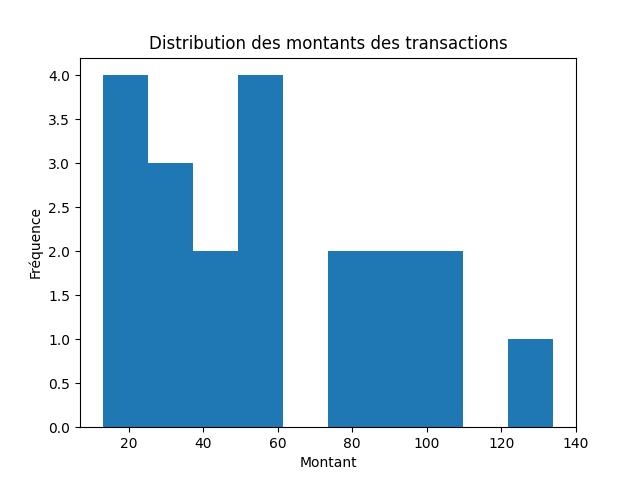

# Réponses aux Questions du TP

## Contexte

Les données sont stockées dans une collection appelée `sales`. Chaque document dans cette collection représente une transaction de vente avec les champs suivants :

- `transaction_id`
- `date`
- `customer_id`
- `product_id`
- `quantity`
- `price`
- `total_amount`
- `store_id`

## Questions et analyses statistiques

### 1. Nombre total de transactions

```js
db.sales.countDocuments()
20
```

### 2. Ventes totales par jour

```js
db.sales.aggregate([{
$group: {
_id: { $dateToString: { format: "%Y-%m-%d", date: "$date" } },
totalSales: { $sum: "$total_amount" }
}
}
])

[
  { _id: '2023-07-01', totalSales: 59.96 },
  { _id: '2023-06-23', totalSales: 89.99 },
  { _id: '2023-06-26', totalSales: 23.97 },
  { _id: '2023-06-16', totalSales: 32.97 },
  { _id: '2023-06-22', totalSales: 57.98 },
  { _id: '2023-06-13', totalSales: 12.99 },
  { _id: '2023-06-17', totalSales: 89.98 },
  { _id: '2023-06-28', totalSales: 47.98 },
  { _id: '2023-06-29', totalSales: 29.99 },
  { _id: '2023-06-27', totalSales: 75.96 },
  { _id: '2023-06-18', totalSales: 55.99 },
  { _id: '2023-06-19', totalSales: 23.96 },
  { _id: '2023-07-02', totalSales: 19.98 },
  { _id: '2023-06-21', totalSales: 77.99 },
  { _id: '2023-06-15', totalSales: 33.99 },
  { _id: '2023-06-14', totalSales: 45.98 },
  { _id: '2023-06-20', totalSales: 50.97 },
  { _id: '2023-06-25', totalSales: 99.99 },
  { _id: '2023-06-30', totalSales: 104.97 },
  { _id: '2023-06-24', totalSales: 133.98 }
]
```

### 3. Ventes totales par produit

```js
db.sales.aggregate([{
$group: {
_id: "$product_id",
totalSales: { $sum: "$total_amount" }
}
}
])

[
  { _id: 'P67903', totalSales: 89.98 },
  { _id: 'P67915', totalSales: 29.99 },
  { _id: 'P67914', totalSales: 47.98 },
  { _id: 'P67900', totalSales: 45.98 },
  { _id: 'P67902', totalSales: 32.97 },
  { _id: 'P67918', totalSales: 19.98 },
  { _id: 'P67904', totalSales: 55.99 },
  { _id: 'P67913', totalSales: 75.96 },
  { _id: 'P67917', totalSales: 59.96 },
  { _id: 'P67905', totalSales: 23.96 },
  { _id: 'P67912', totalSales: 23.97 },
  { _id: 'P67916', totalSales: 104.97 },
  { _id: 'P67899', totalSales: 12.99 },
  { _id: 'P67901', totalSales: 33.99 },
  { _id: 'P67906', totalSales: 50.97 },
  { _id: 'P67910', totalSales: 133.98 },
  { _id: 'P67911', totalSales: 99.99 },
  { _id: 'P67908', totalSales: 57.98 },
  { _id: 'P67909', totalSales: 89.99 },
  { _id: 'P67907', totalSales: 77.99 }
]
```

### 4. Top 5 des produits les plus vendus

```js
db.sales.aggregate([
{
$group: {
_id: "$product_id",
totalQuantity: { $sum: "$quantity" }
}
},
{ $sort: { totalQuantity: -1 } },
{ $limit: 5 }
])

[
  { _id: 'P67917', totalQuantity: 4 },
  { _id: 'P67913', totalQuantity: 4 },
  { _id: 'P67905', totalQuantity: 4 },
  { _id: 'P67912', totalQuantity: 3 },
  { _id: 'P67902', totalQuantity: 3 }
]
```

### 5. Revenu moyen par transaction

```js
db.sales.aggregate([
{
$group: {
_id: null,
avgRevenue: { $avg: "$total_amount" }
}
}
])

[ { _id: null, avgRevenue: 58.4785 } ]
```

### 6. Nombre de clients uniques

```js
db.sales.distinct("customer_id").length
20
```

### 7. Répartition des ventes par magasin

```js
db.sales.aggregate([
{
$group: {
_id: "$store_id",
totalSales: { $sum: "$total_amount" }
}
}
])

[
  { _id: 'S001', totalSales: 335.83 },
  { _id: 'S002', totalSales: 350.86 },
  { _id: 'S003', totalSales: 482.88 }
]
```

### 8. Écart type des montants des transactions

```js
db.sales.aggregate([
{
$group: {
_id: null,
stdDev: { $stdDevPop: "$total_amount" }
}
}
])

[ { _id: null, stdDev: 32.08104756316414 } ]
```

### 9. Distribution des quantités vendues par produit

```js
db.sales.aggregate([
{
$group: {
_id: "$product_id",
quantities: { $push: "$quantity" },
avgQuantity: { $avg: "$quantity" },
minQuantity: { $min: "$quantity" },
maxQuantity: { $max: "$quantity" },
stdDevQuantity: { $stdDevPop: "$quantity" }
}
}
])

[
  {
    _id: 'P67903',
    quantities: [ 2 ],
    avgQuantity: 2,
    minQuantity: 2,
    maxQuantity: 2,
    stdDevQuantity: 0
  },
  {
    _id: 'P67915',
    quantities: [ 1 ],
    avgQuantity: 1,
    minQuantity: 1,
    maxQuantity: 1,
    stdDevQuantity: 0
  },
  {
    _id: 'P67907',
    quantities: [ 1 ],
    avgQuantity: 1,
    minQuantity: 1,
    maxQuantity: 1,
    stdDevQuantity: 0
  },
  {
    _id: 'P67908',
    quantities: [ 2 ],
    avgQuantity: 2,
    minQuantity: 2,
    maxQuantity: 2,
    stdDevQuantity: 0
  },
  {
    _id: 'P67909',
    quantities: [ 1 ],
    avgQuantity: 1,
    minQuantity: 1,
    maxQuantity: 1,
    stdDevQuantity: 0
  },
  {
    _id: 'P67911',
    quantities: [ 1 ],
    avgQuantity: 1,
    minQuantity: 1,
    maxQuantity: 1,
    stdDevQuantity: 0
  },
  {
    _id: 'P67910',
    quantities: [ 2 ],
    avgQuantity: 2,
    minQuantity: 2,
    maxQuantity: 2,
    stdDevQuantity: 0
  },
  {
    _id: 'P67906',
    quantities: [ 3 ],
    avgQuantity: 3,
    minQuantity: 3,
    maxQuantity: 3,
    stdDevQuantity: 0
  },
  {
    _id: 'P67899',
    quantities: [ 1 ],
    avgQuantity: 1,
    minQuantity: 1,
    maxQuantity: 1,
    stdDevQuantity: 0
  },
  {
    _id: 'P67901',
    quantities: [ 1 ],
    avgQuantity: 1,
    minQuantity: 1,
    maxQuantity: 1,
    stdDevQuantity: 0
  },
  {
    _id: 'P67905',
    quantities: [ 4 ],
    avgQuantity: 4,
    minQuantity: 4,
    maxQuantity: 4,
    stdDevQuantity: 0
  },
  {
    _id: 'P67912',
    quantities: [ 3 ],
    avgQuantity: 3,
    minQuantity: 3,
    maxQuantity: 3,
    stdDevQuantity: 0
  },
  {
    _id: 'P67916',
    quantities: [ 3 ],
    avgQuantity: 3,
    minQuantity: 3,
    maxQuantity: 3,
    stdDevQuantity: 0
  },
  {
    _id: 'P67904',
    quantities: [ 1 ],
    avgQuantity: 1,
    minQuantity: 1,
    maxQuantity: 1,
    stdDevQuantity: 0
  },
  {
    _id: 'P67913',
    quantities: [ 4 ],
    avgQuantity: 4,
    minQuantity: 4,
    maxQuantity: 4,
    stdDevQuantity: 0
  },
  {
    _id: 'P67902',
    quantities: [ 3 ],
    avgQuantity: 3,
    minQuantity: 3,
    maxQuantity: 3,
    stdDevQuantity: 0
  },
  {
    _id: 'P67900',
    quantities: [ 2 ],
    avgQuantity: 2,
    minQuantity: 2,
    maxQuantity: 2,
    stdDevQuantity: 0
  },
  {
    _id: 'P67917',
    quantities: [ 4 ],
    avgQuantity: 4,
    minQuantity: 4,
    maxQuantity: 4,
    stdDevQuantity: 0
  },
  {
    _id: 'P67914',
    quantities: [ 2 ],
    avgQuantity: 2,
    minQuantity: 2,
    maxQuantity: 2,
    stdDevQuantity: 0
  },
  {
    _id: 'P67918',
    quantities: [ 2 ],
    avgQuantity: 2,
    minQuantity: 2,
    maxQuantity: 2,
    stdDevQuantity: 0
  }
]
```

### 10. Médiane des ventes par magasin

```js

db.sales.aggregate([
  {
    $group: {
      _id: "$store_id",
      sales: { $push: "$total_amount" },
      count: { $sum: 1 }
    }
  },
  {
    $project: {
      _id: 1,
      sales: 1,
      count: 1,
      middle: { $ceil: { $divide: ["$count", 2] } }
    }
  },
  {
    $unwind: "$sales"
  },
  {
    $sort: { sales: 1 }
  },
  {
    $group: {
      _id: "$_id",
      sales: { $push: "$sales" },
      middle: { $first: "$middle" }
    }
  },
  {
    $project: {
      _id: 1,
      median: { $arrayElemAt: ["$sales", { $subtract: ["$middle", 1] }] }
    }
  }
])

[
  { _id: 'S001', median: 47.98 },
  { _id: 'S002', median: 45.98 },
  { _id: 'S003', median: 75.96 }
]
```

### 11. Quartiles des montants des transactions

```js
db.sales.aggregate([
  {
    $group: {
      _id: null,
      transactions: { $push: "$total_amount" },
      count: { $sum: 1 }
    }
  },
  {
    $project: {
      transactions: 1,
      count: 1,
      q1: { $ceil: { $divide: ["$count", 4] } },
      q3: { $ceil: { $multiply: [{ $divide: ["$count", 4] }, 3] } }
    }
  },
  {
    $unwind: "$transactions"
  },
  {
    $sort: { transactions: 1 }
  },
  {
    $group: {
      _id: null,
      transactions: { $push: "$transactions" },
      q1: { $first: "$q1" },
      q3: { $first: "$q3" }
    }
  },
  {
    $project: {
      q1: { $arrayElemAt: ["$transactions", { $subtract: ["$q1", 1] }] },
      median: { $arrayElemAt: ["$transactions", { $subtract: ["$count", 2] }] },
      q3: { $arrayElemAt: ["$transactions", { $subtract: ["$q3", 1] }] }
    }
  }
])

[ { _id: null, q1: 29.99, median: null, q3: 77.99 } ]
```

### 12. Représenter graphiquement les données

```js
import pandas as pd
import matplotlib.pyplot as plt
from pymongo import MongoClient

# Connexion à MongoDB
client = MongoClient('localhost', 27017)
db = client['sales_database']
collection = db['sales']

# Charger les données depuis MongoDB
data = list(collection.find({}, {"_id": 0, "total_amount": 1}))

# Convertir en DataFrame
df = pd.DataFrame(data)

# Créer un histogramme des montants des transactions
plt.hist(df['total_amount'], bins=10)
plt.title('Distribution des montants des transactions')
plt.xlabel('Montant')
plt.ylabel('Fréquence')
plt.show()


```


